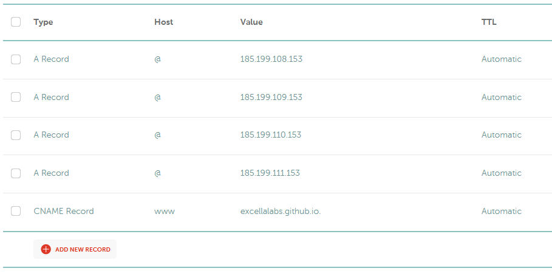

# Blog in a Box

A quick, all in one stop for someone to get a blog presence up and running.

## Congratulations on Getting Started! :tada: :+1:

The world needs your voice. Good on you for putting it out there.

## Need Help? Trying to accomplish something but unsure how?

If you have questions about this project or how to use it, don't hesitate to [open an issue](https://github.com/excellalabs/blog-in-a-box/issues/new) (though please check the FAQs in this doc first just ot tobe sure). We're happy to point you in the right direction.

## Topics

* [Should you fork this or copy it?](docs/_posts/2022-01-01-welcome-to-biab.md)
* [The Ingredients](docs/_posts/2022-01-02-the-ingredients.md)
* [Prerequisites](docs/_posts/2022-01-03-prerequisites.md)
* [Getting Started](docs/_posts/2022-01-04-getting-started.md)
* [Opening the Project for Development](docs/_posts/2022-01-05-opening.md)
* [Running Commands](docs/_posts/2022-01-06-running-commands.md)
* [Protecting Your Branch to ensure build steps run](docs/_posts/2022-01-07-protecting-your-branches.md)

### Setting up Scheduled Posts

By default, this blog has a GitHub Action that will run to publish every hour. That way, you can create a post for the future, and when the build runs and that post is no longer in the future, it will be published.

You'll need to take one of two actions. If you don't want scheduled posts, delete `scheduled-posts.yml` from the `.github` directory.

If you do want scheduled posts:

* You'll need to generate a token called `PAGES_ACCESS_TOKEN` and save it, [as described here](https://seankilleen.com/2020/02/how-to-deploy-github-pages-on-a-schedule-to-publish-future-posts/). The general summary is:
  * Go to [your GitHub tokens settings](https://github.com/settings/tokens)
  * Click the button to create a new token, and give it a name like "Scheduled Posts" or similar.
  * For the permissions, specify `public_repo`.
  * Copy the Access token for use in the next step.
* Add the secret for GitHub actions
  * Go into the settings of your GitHub repository.
  * Select `Secrets --> Actions` from the left-hand menu.
  * Click the `New Repository Secret` button
  * Name the secret `PAGES_ACCESS_TOKEN` and paste the value in.
* Update the repository value in the `scheduled-posts.yml` file -- instead of `excellalabs/blog-in-a-box`, use your username and repository name.

### Setting up comments using Giscus

The "minimal mistakes" theme that this ships with allows for a number of different comment set ups. But out of the box, we wanted to enable a quick path comments for your sites.

[Giscus](https://giscus.app/) allows you to use the GitHub Discussions feature, which comes built into GitHub for your repository, to host comments on your blog. To set up Giscus comments:

* Enable discussions for your repository. If you don't see the "Discussions" tab, you can go to the settings for your repository, and under the `Features` section, check the `Discussions` box.
* On the discussions tab, click the pencil icon next to Categories, and create a new category called "Blog Comments" or similar. Make sure you set the discussion format to `Announcement`, because you only want the Giscus app (which we'll set up shortly) to be the one managing comments.
* Navigate to the [Giscus app](https://giscus.app/) and follow the instructions to set it up.
  * As part of the instructions, you'll have to add the Giscus app to your repository. This will show a warning, but is perfectly fine for use and you can feel comfortable accepting it.
  * For the repository name, you'll use your username and the repository name, e.g. `excellalabs/blog-in-a-box` for this one.
  * You'll copy the ID, category ID, etc. from the Giscus app -- rather than copying the `<script>` tag that it supplies, you'll copy the informational bits into the `giscus` configuration in your `docs/_config.yml` file.

### Deploying Your Blog

This can get a little tricky so we'll walk through this example with Namecheap and provide some screenshots.

* Add a file to the root of the repository called `CNAME`. The contents of the file should be the domain name or subdomain you're deploying to, e.g. `blog.mysite.com` or `bloginaboxdemo.com`.
* Save the file, commit it, and merge the change.
  * (are these terms completely unfamiliar? That's ok! Feel free to [create an issue in this repository](https://github.com/excellalabs/blog-in-a-box/issues/new) and we'll help you walk through it.)

Next up, it's time to Get the GitHub Pages settings in place.

* In your repository on GitHub, navigate to the `Settings` tab and click it.
* On the left-hand navigation, choose `Pages` for pages settings.
* From the `Source` drop-down, select the `main` branch. You can think of this branch like "production". Anything merged into it will get published (unless it's a future post).
* Change the `Folder` option from `/(root)` to `/docs` and click `Save`.
* Note: we're _not_ going to choose a theme, because we're already using a theme that comes bundled with our blog.

With those settings in place, next  we need to go to our domain registrar or the organization who handles DNS (in our example, we're using [Namecheap](https://namecheap.com), because Sean loves them.) We're going to follow the [GitHub Pages custom domain instructions](https://docs.github.com/en/pages/configuring-a-custom-domain-for-your-github-pages-site/managing-a-custom-domain-for-your-github-pages-site) here. The instructions below work if you're using an "apex" or "naked" domain, such as our `bloginaboxdemo.com` site. If you're using a sub-domain, follow the instructions at the above link. [Create an issue](https://github.com/excellalabs/blog-in-a-box/issues/new) if you get stuck, and we'll help you.

* Log into Namecheap and go to the domain's settings.
* Click the "Advanced DNS" button" to go to DNS settings
* If it's a new domain, remove any default DNS records that are there. Otherwise, be careful what you change (and feel free to ask us for help by [creating an issue](https://github.com/excellalabs/blog-in-a-box/issues/new)).
* For each of the IP Addresses [in the Apex domain instructions](https://docs.github.com/en/pages/configuring-a-custom-domain-for-your-github-pages-site/managing-a-custom-domain-for-your-github-pages-site#configuring-an-apex-domain) (at the time, `185.199.108.153`, `185.199.109.153`, `185.199.110.153`, `185.199.111.153`):  
  * Create a new record, of type `A`.
  * Make the host `@` (which is short-hand for the "naked domain", or `yoursite.com`).
  * Make the value the IP address
  * Repeat for all IP addresses
* Click to save your changes.
* Next you'll likely want to create a `www` subdomain so that `www.yoursite.com` and `yoursite.com` go to the same place.
  * Create a new DNS record, of type `CNAME`. Set the host as `www`, and the value as `yourusername.github.io`. For example, this repo is hosted on the `excellalabs` org, so our value would be `excellalabs.github.io`.

Here's an example of how the DNS records might look:

At this point, your DNS changes should be live soon (they take some time to propagate -- sometimes more than 24 hours). Then, your blog should be available at the URL you configured.

Now we can enforce `HTTPS`, which is important for the security of the web.

* Go back to the GitHub Pages settings
* Check the `Enforce HTTPS` option. You'll see a green checkmark after it automatically saves.

### Updating to a later version of our theme

This blog setup uses the [minimal mistakes theme](https://github.com/mmistakes/minimal-mistakes).

In the `docs/_config.yml` file, you'll see the line `remote_theme: "mmistakes/minimal-mistakes@4.24.0"` (at the time of this writing). This means we're using release `v4.24.0` of the theme.

From time to time, the theme may be updated and you'll see the update on [its releases page](https://github.com/mmistakes/minimal-mistakes/releases). If you want to be notified of updates, you can [go to the theme repository home page](https://github.com/mmistakes/minimal-mistakes), select `Watch --> Custom --> Releases`, which will subscribe you to release notifications.

If you want to update to a release, we recommend you:

* Read the release notes, which will contain information on breaking changes, upgrade steps, etc.
* Note the version number on the release tag
* Update the `_config.yml` to update the version in the `remote_theme` variable.

### Adding a live preview of pull requests using Netlify

[Netlify](https://www.netlify.com/) is a phenomenal service for building and hosting web content similar to GitHub Pages (in fact, the capabilities go quite a bit beyond GitHub Pages for many scenarios). For our purposes, Netlify can be very useful to add automated previews so you can see your blog changes before they're live. Netlify allows public blogs and processes to use these services for free, and we're grateful to them for doing so.

You can set up deployments by:

* Creating a free Netlify account
* On your account dashboard, Under `Sites`, click `Add a New Site` and then `Import an existing project`.
* Connect Netlify to your github account and repository on the next page to allow Netlify to "see" your repository.
* Set the base directory as `docs` to correspond to our `docs` folder
* Set the publish directory to `docs/_site`, the default output for our Jekyll build.
* Set the build command to `bundle exec jekyll build --future`. This ensures the build will publish future posts as well, which will be important if you want to preview a future post that you're authoring or scheduling.
* Click "Deploy site". Netlify will do the rest.

## Q & A

### Why is the blog in a `/docs` folder?

GitHub Pages, where we presume you are deploying, has some rules for what can be deployed. If deploying from the main branch, you have two options: `(root)`, or the base directory of the repository, and `/docs`. In our case, we didn't want the other stuff in the root to get confused with the actual blog stuff, so we chose `/docs` because that's the name available that fits into our batteries-included setup with the least amount of fuss.

There are ways to customize this, particularly by using a `gh-pages` branch and creating a GitHub Action to push to it, but we figured that might be over-complicated. Feel free to reach out if you want to set that up and we may follow up with some more on this in the future.

### Why are there two `markdownlint` configuration files?

`.markdownlintrc` is for the GitHub Actions build step, and `.markdownlint.json` is for the VS Code extension that underlines issues. We'll see if we can combine them into one file, but that's why they exist currently.
